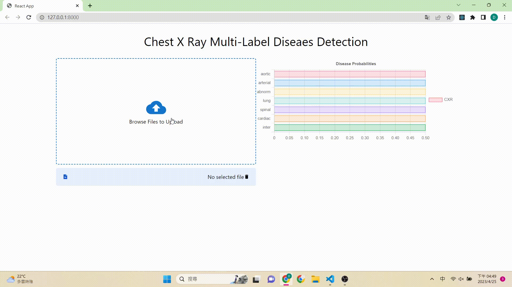

# Docker-Development 2023-04-26

We develop our CXR application on docker with Django as backend, React as frontend.

The detail of the overall application is located at [https://github.com/DongDong-Zoez/Multi-Label-CXR-Classifier-Docker-Develop](https://github.com/DongDong-Zoez/Multi-Label-CXR-Classifier-Docker-Develop)

## Frontend

We build our frontend framwork with React

The data type of image data send to backend is ```FormData```
To receive the response form the backend, We use base64 format to view the image.

## Backend 

We build our backend server with Django

To response the GradCAM image, we first translate np array to PIL image then translate it to base64.

## Visualization

To illustrate model's attentions, we upscale 32 times of the last layer of the feature map (1024 * 7 * 7) --> (224 * 224) and average them. (The processor is known as gradcam)

```python
from pytorch_grad_cam import GradCAM, HiResCAM, ScoreCAM, GradCAMPlusPlus, AblationCAM, XGradCAM, EigenCAM, FullGrad
from pytorch_grad_cam.utils.model_targets import ClassifierOutputTarget
from pytorch_grad_cam.utils.image import show_cam_on_image
from torchvision.models import resnet50
import matplotlib.pyplot as plt

from model import CXRNet
from augmentations import get_transform
import torch

model = CXRNet()
state_dict = torch.load("/home/dongdong/Medical-Image-Analysis/CXR/0.8975focal.pth")
model.load_state_dict(state_dict)
model_children = list(model.features.children())

target_layers = model_children[0]

device = torch.device("cuda" if torch.cuda.is_available() else "cpu")
model = model.to(device)

image = plt.imread("/home/dongdong/Medical-Image-Analysis/CXR/xray_jpg/small_pulmonary_nodules/10_0.jpg")

transform = get_transform(train=False, img_size=224, rotate_degree=0)
image = transform(image=image)["image"]
origin = image.numpy().transpose(1,2,0)
origin = origin - origin.min()
origin = origin / origin.max()
image = image.unsqueeze(0)
image = image.to(device)

input_tensor = image
cam = GradCAMPlusPlus(model=model, target_layers=target_layers, use_cuda=True)

targets = None

grayscale_cam = cam(input_tensor=input_tensor, targets=targets)

grayscale_cam = grayscale_cam[0, :]
visualization = show_cam_on_image(origin, grayscale_cam, use_rgb=True)
plt.imsave(str('res/feature_maps.jpg'), visualization)
```

## Docker

To make sure the application will work at cross-platform, we build it on the docker, with the dockerfile

```Dockerfile
# Use an official Python runtime as a parent image
FROM python:3.8-slim-buster

# Set the working directory to /app
WORKDIR /app

# Copy the requirements file into the container at /app
COPY requirements.txt /app/

# Install the required packages
RUN pip install --no-cache-dir -r requirements.txt

RUN apt-get update && apt-get install -y python3-opencv
RUN pip install opencv-python

# Copy the backend code into the container at /app
COPY . /app/

# Install Node.js and npm
RUN apt-get install -y curl
RUN curl -sL https://deb.nodesource.com/setup_14.x | bash -
RUN apt-get install -y nodejs

# Change the working directory to the frontend
WORKDIR /app/frontend

# Install the required packages for the frontend
RUN npm install

# Build the frontend
RUN npm run build

# Change the working directory back to /app
WORKDIR /app

# Expose the port the application will run on
EXPOSE 8000

# Start the Django development server and the React app
# CMD ["sh", "-c", "python manage.py makemigrations"]
# CMD ["sh", "-c", "python manage.py migrate"]
CMD ["sh", "-c", "python manage.py runserver 0.0.0.0:8000 & cd frontend && npm run start"]
```

After the following command for running the docker container:

```sh
docker build -t cxr .
docker run -p 8000:8000 cxr
```

We can view our application at http://127.0.0.1:8000

## Result

