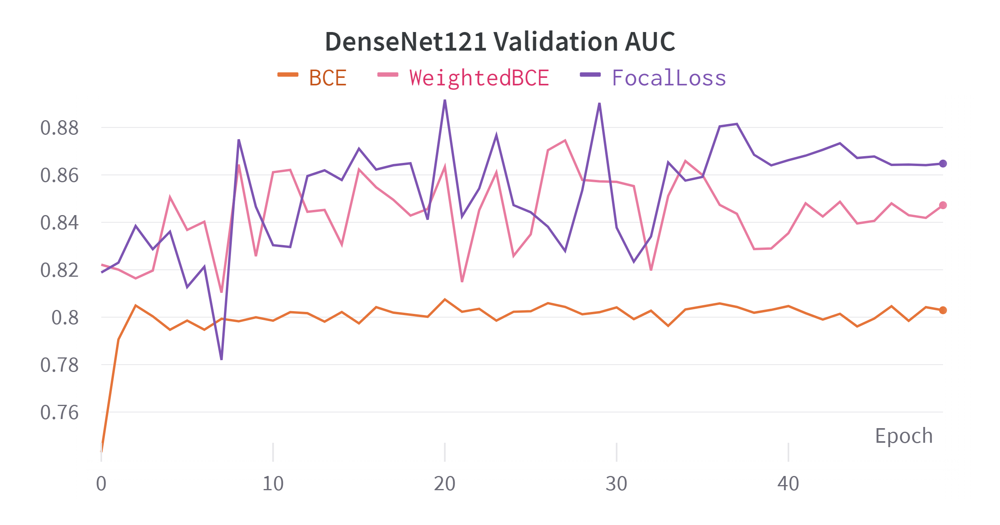
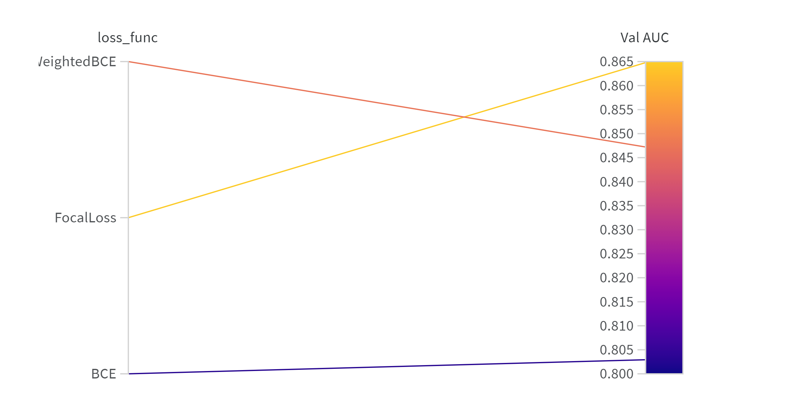

# BinaryCrossEntropy a survey 2023-04-05

System hardware:

- System: Ubuntu 20.04 
- CPU count:	14
- GPU count:	1
- GPU type :	NVIDIA GeForce RTX 3050 Ti Laptop GPU

In this experimental, we survey the impact of difference loss function on E-DA CXR dataset, with densenet121 as our backbone

## Configuration

The origin dataset are split into training, validation and testing, the support list in the following:

| Disease/DataSet        | Train | Valid | Test |
|------------------|--------|---------|---------|
| 主動脈硬化(鈣化)   | 67     | 8       | 9       |
| 動脈彎曲         | 74     | 9       | 9       |
| 肺野異常         | 24     | 3       | 3       |
| 肺紋增加         | 106    | 14      | 13      |
| 脊椎病變         | 114    | 15      | 14      |
| 心臟肥大         | 33     | 4       | 4       |
| 肺尖肋膜增厚      | 29     | 4       | 3       |

The basis configuraions are the following:

- `base_root` : The base data directory path. Default is '/home/dongdong/Medical-Image-Analysis/CXR/xray_jpg/'
- `csv_name` : The name of the CSV file containing the dataset. Default is 'chest_dongdong.csv'
- `epochs` : The number of training epochs. Default is 50.
- `save_name` : The name of the file to save the trained model. Default is 'model.pth'.
- `lr` : The learning rate for the optimizer. Default is 1e-4.
- `weight_decay` : The weight decay for the optimizer. Default is 0.
- `pretrained` : Whether to use transfer learning or not. Default is True.
- `num_classes` : The number of classes. Default is 7.
- `loss_func` : The loss function. Default is 'BCE'.

## Experimental Results

In this experimental, we compare the following normal loss function with imbalance data, and the result is shown as the following:

The graphs indicate that WeightedFocalLoss and WeightedBCE Loss function outperformed Binary Cross Entropy

The best result are shown as the following table:

| Loss function | Train | Validation | Test | 
| ------------- | ----- | ---------- | ---- |
| BCE | 0.8641 | 0.8075 | 0.8152 |
| AUC-M | 0.8804 | 0.8603 | 0.8621 |
| Weighted BCE | 0.9889 | 0.8827 | 0.8720 |
| Weighted Focal Loss | 0.9911 | 0.8975 | 0.8595 |

**BCE:**

|      | 主動脈硬化(鈣化) | 動脈彎曲 | 肺野異常 | 肺紋增加 | 脊椎病變 | 心臟肥大 | 肺尖肋膜增厚 |
|:--:|:----------------:|:--------:|:--------:|:--------:|:--------:|:--------:|:------------:|
| Train    | 0.928                  | 0.910    | 0.869     | 0.871     | 0.777     | 0.944     | 0.749         |
| Validation | 0.865                  | 0.843    | 0.708     | 0.864     | 0.713     | 0.958     | 0.701         |
| Test     | 0.946                  | 0.811    | 0.758     | 0.908     | 0.775     | 0.923     | 0.586         |

**AUC-M:**

|      | 主動脈硬化(鈣化) | 動脈彎曲 | 肺野異常 | 肺紋增加 | 脊椎病變 | 心臟肥大 | 肺尖肋膜增厚 |
|:--:|:----------------:|:--------:|:--------:|:--------:|:--------:|:--------:|:------------:|
| **Train** | 0.9374 | 0.9068 | 0.9093 | 0.8487 | 0.7625 | 0.9559 | 0.8424 |
| **Validation** | 0.9177 | 0.8961 | 0.6854 | 0.9286 | 0.7423 | 0.9371 | 0.9151 |
| **Test** | 0.9541 | 0.8380 | 0.8841 | 0.8884 | 0.7462 | 0.9203 | 0.8033 |

**Weighted BCE:**

|          | 主動脈硬化(鈣化) | 動脈彎曲  | 肺野異常   | 肺紋增加   | 脊椎病變   | 心臟肥大   | 肺尖肋膜增厚 |
|:--:|:----------------:|:--------:|:--------:|:--------:|:--------:|:--------:|:------------:|
| Train    | 0.984             | 0.988    | 0.973     | 0.985     | 0.992     | 0.999     | 1.000         |
| Validation | 0.863           | 0.851    | 0.819     | 0.872     | 0.913     | 0.983     | 0.879         |
| Test     | 0.941            | 0.771    | 0.832     | 0.904     | 0.772     | 0.964     | 0.919         |

**Weighted Focal Loss:**

|    | 主動脈硬化(鈣化) | 動脈彎曲 | 肺野異常 | 肺紋增加 | 脊椎病變 | 心臟肥大 | 肺尖肋膜增厚 |
|:--:|:----------------:|:--------:|:--------:|:--------:|:--------:|:--------:|:------------:|
| Train |     0.9283     |   0.9101   |   0.8688   |   0.8713   |   0.7774   |   0.9441   |     0.7489     |
| Validation |     0.8645     |   0.8434   |   0.7083   |   0.8643   |   0.7131   |   0.9575   |     0.7013     |
| Test |     0.9462     |   0.8108   |   0.7578   |   0.9078   |   0.7748   |   0.9234   |     0.5859     |
