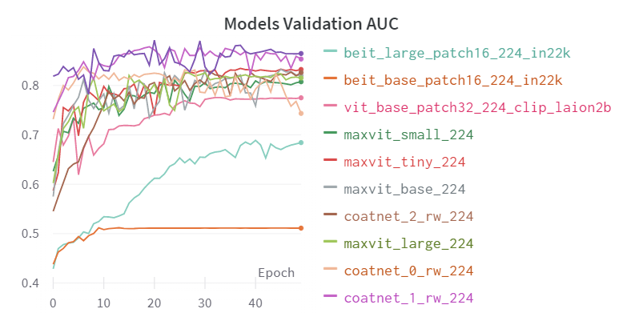

# Transformers Loss Function: a survey 2023-04-12

System hardware:

- System: Ubuntu 20.04 
- CPU count:	14
- GPU count:	1
- GPU type :	NVIDIA GeForce RTX 3050 Ti Laptop GPU

In this experimental, we survey the impact of difference loss function on E-DA CXR dataset, with densenet121 as our backbone

## Configuration

The origin dataset are split into training, validation and testing, the support list in the following:

| Disease/DataSet        | Train | Valid | Test |
|------------------|--------|---------|---------|
| 主動脈硬化(鈣化)   | 67     | 8       | 9       |
| 動脈彎曲         | 74     | 9       | 9       |
| 肺野異常         | 24     | 3       | 3       |
| 肺紋增加         | 106    | 14      | 13      |
| 脊椎病變         | 114    | 15      | 14      |
| 心臟肥大         | 33     | 4       | 4       |
| 肺尖肋膜增厚      | 29     | 4       | 3       |

The basis configuraions are the following:

- `base_root` : The base data directory path. Default is '/home/dongdong/Medical-Image-Analysis/CXR/xray_jpg/'
- `csv_name` : The name of the CSV file containing the dataset. Default is 'chest_dongdong.csv'
- `epochs` : The number of training epochs. Default is 50.
- `save_name` : The name of the file to save the trained model. Default is 'model.pth'.
- `lr` : The learning rate for the optimizer. Default is 1e-5.
- `weight_decay` : The weight decay for the optimizer. Default is 1e-4.
- `pretrained` : Whether to use transfer learning or not. Default is True.
- `num_classes` : The number of classes. Default is 7.
- `loss_func` : The loss function. Default is 'FocalLoss'.

## Coordinate Plot

We examinate the hyperparameters of weight decay and learning rate (backbone is CoatNet 1), the following plot show the result 

The best hyperparameters is (weight decay, learning rate) = (1e-4, 1e-5)

## Loss function in Transformer

| Loss function | Validation | Test | 
| ------------- | ---------- | ---- |
| BCE | 0.5804 | 0.5966|
| AUC-M | 0.863 | 0.7812 |
| Weighted BCE | 0.863 | 0.7812 |
| Weighted Focal Loss | 0.8960 | 0.8783 |

**Weighted Focal Loss:**

| Dataset    |   主動脈硬化(鈣化)   |   動脈彎曲   |   肺野異常   |   肺紋增加   |   脊椎病變   |   心臟肥大   |   肺尖肋膜增厚   |
|:--:|:----------------:|:--------:|:--------:|:--------:|:--------:|:--------:|:------------:|
| Validation |   0.8887   |   0.8947       |   0.8458       |   0.8806       |   0.8757       |   0.9764       |   0.9104               |
| Test       |   0.9290   |   0.8789       |   0.9110       |   0.8594       |   0.8214       |   0.9594       |   0.7888               |

## Experimental Results

The following table indicate the performance of transformers architecture with weighted focal loss.

The results are shown below:

| ModelName | Valid AUC | Test AUC | params(M) |
|-----------|-----------|----------|--------|
|tv_densenet121|<a class="max">0.8975</a>|0.8595|7.98|
|vit_base_patch32_224_clip_laion2b|0.7765|0.7852|88.2|
|beit_base_patch16_224_in22k|0.5119|0.5443|102.56|
|beit_large_patch16_224_in22k|0.6889|0.6547|<a class="max">325.79</a>|
|maxvit_tiny_224|0.8358|0.8332|30.92|
|maxvit_small_224|0.8243|0.8379|68.93|
|maxvit_base_224|0.8335|0.8566|119.47|
|maxvit_large_224|0.8270|0.8393|211.79|
|coatnet_0_rw_224|0.8416|0.8361|27.44|
|coatnet_1_rw_224|0.8960|<a class="max">0.8783</a>|41.72|
|coatnet_2_rw_224|0.8256|0.8559|73.89|

### Related architecture

- DenseNet
   - original source: https://github.com/baaivision/EVA
   - paper: https://arxiv.org/pdf/1608.06993.pdf
- BEiT
   - paper: https://arxiv.org/pdf/2211.07636.pdf
- MaxViT
   - paper: https://arxiv.org/pdf/2204.01697.pdf
- CoATNet
   - paper: https://arxiv.org/pdf/2106.04803.pdf

## Some Insights

During training phase, we have found some insights

1. The imbalance ratio of the data is 4%, and it is impossible for training with CE
2. Compare to Transformer, CNN models usually converge faster and more accuracy
3. Transformers architecture often need a low learning rate (1e-5 or 1e-6) for training 
4. Smaller model is better, but need to large enough to leverage image features
5. Transformer models often less accuracy compare to DenseNet121, we thought that it is because of transformer is often larger than CNN model, therefore, more data need to be add in the training phase
6. Loss function did influenced model performance significantly

## Future Work

1. Ensemble 
2. KFold
3. More hyperparameters
4. Add the information of metadata
5. Self-surpervised for pretraining
6. Compare more model
7. Collect more data 
