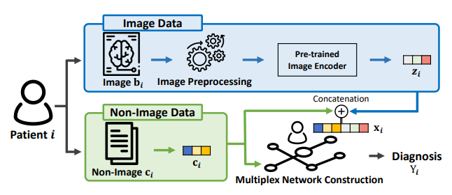
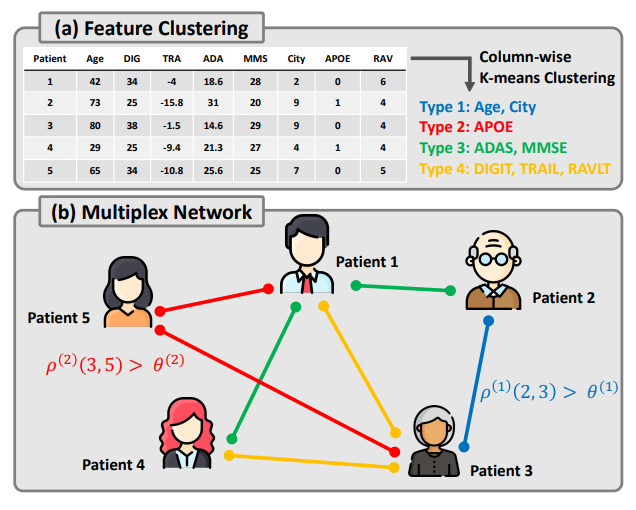
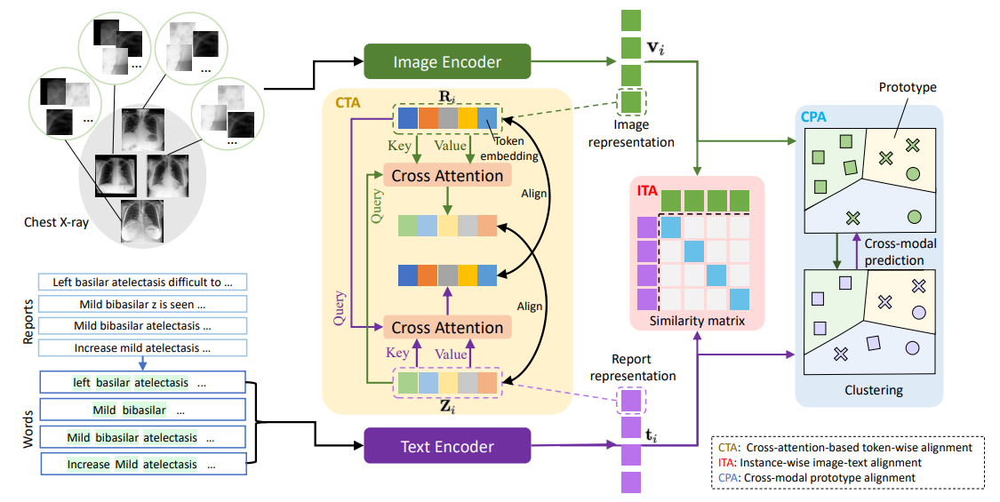

# Multi-Modal Medical Image Analysis

本周我們研究多模態在醫學影像上的應用，並指出未來可能作為研究主題或方向的題目

## Auxiliary Signal-Guided Knowledge Encoder-Decoder for Medical Report Generation

paper: [https://arxiv.org/pdf/2006.03744.pdf](https://arxiv.org/pdf/2006.03744.pdf)

作者引入了先驗知識圖的結構來做多模態的醫學文本生成

主要步驟分為三個區塊

1. external auxiliary signal-guide pretraining
2. DenseNet pretraining
3. internal auxiliary guide training

### External Auxiliary Signals

我們透過醫學文本做 Word Embeddings 得到文字向量，之後使用 GRU 單元得到輸出向量，將輸出向量輸入與先驗知識圖一併輸入自注意模塊和文本解碼器得到輸出

### DenseNet Pretraining

簡單的用 CXR 影像和 ROI 影像訓練兩個 DenseNet

### Internal Auxiliary Guide Training

在上述模型都收斂之後，作者使用 224*224 影像訓練整個網路直到收斂

## Heterogeneous Graph Learning for Multi-modal Medical Data Analysis

作者使用了神經網路提取特徵，並接上元資料作為圖神經網路的輸入

paper: [https://arxiv.org/pdf/2211.15158v3.pdf](https://arxiv.org/pdf/2211.15158v3.pdf)

### Build Multiplex Graph

作者建立圖的方法是對元資料做 K-Means 分群

### Inference

作者推斷資料的方式是透過匯聚的技巧，這裡作者採用了平均匯聚

## Multi-Granularity Cross-modal Alignment for Generalized Medical Visual Representation Learning

作者提出了一個新的框架，用於影像信息與醫學報告信息交互的模型預測

paper: [https://arxiv.org/pdf/2210.06044v1.pdf](https://arxiv.org/pdf/2210.06044v1.pdf)

### Overall Framework

作者的框架支援輸入影像以及醫學報告，透過編碼器得到影像與報告的表現形式，之後我們會使用影像表徵和報告表徵做下游任務，之後再結合影像結果與報告結果

### Loss Function

損失函數主要分為三類

1. ITA: 為了使影像表徵和報告表徵盡量一致
2. CTA: 對齊影像表徵和經過交互注意力機制的報告表徵，以及報告表徵和經過交互注意力機制的影像表徵
3. CPA: 影像表徵以及報告表徵在下游任務的損失函數

## Semi-supervised Medical Image Segmentation Using Cross-Model Pseudo-Supervision with Shape Awareness and Local Context Constraints

作者提出了一個新框架用於醫學影像分割領域的半監督學習並加強局部的信息

paper: [https://link.springer.com/chapter/10.1007/978-3-031-16452-1_14](https://link.springer.com/chapter/10.1007/978-3-031-16452-1_14)

由於 Dice Loss 只會考慮到全局信息，故作者將原始影像分為幾個區塊，每個區塊去計算 Dice Loss 以便於考慮到局部信息

## Future Work

1. 對於 CXR 影像的多標籤任務中，目前階段我們將標籤之間的關係忽略，或許我們可以像 HedMed 那樣引入圖信息
2. HedMed 對於建構圖的過程過於粗糙，或許有更好的建立圖方式
3. 透過切割影像來感知局部信息的損失函數設計也有些欠佳，例如
   - 怎麼分割? 分割成幾塊?
   - 圖塊邊界之間要如何處理? 
4. MGCA 方法並未引入元資料，這是後續可以考慮的方向