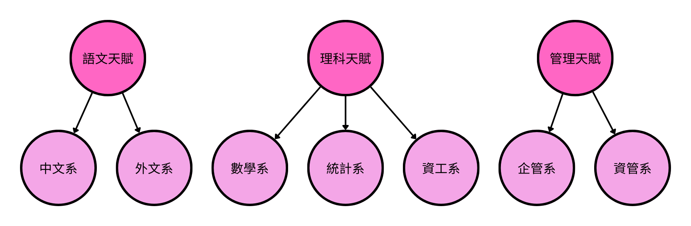

# Regression Latent Class Analysis

我們將會用簡單的直觀角度帶入潛在變量分析的領域

## 一個簡單的例子

假設我們想要調查一個高中生上大學後會選擇什麼樣的專科，我們可以透過各種不同方式去調查，例如，根據學生的修課成績、興趣愛好、職業志向、家庭背景、經濟狀況等等原因，我們大概可以推斷這個學生的未來志向

我們有很多種方式去預測高中生的未來志向，例如，我們可以根據現有資料把上述提到的每個原因當成變數去訓練一個 logistic 回歸，預測選擇每個專科的可能性

但是注意到在上述的例子中，我們把預測每個專科的成績當成是獨立的，也就是預測高中生會**選擇數學系與統計系當成獨立事件處理**，但是，真的是這樣嗎? 根據我們的直覺，一個學生會選擇數學系很大程度與選擇統計相關

我們為什麼會有這種直觀的想法呢? 這是因為**數學與統計都屬於理科天賦**，因為該高中生有理科天賦，所以他當然對於數學與統計都有興趣，但是請注意，理科天賦並不存在我們的資料中，我們稱這一類無法被觀測到的資料為 **latent variable**

回想我們之前是怎麼處理這一類的問題的。我們多半使用 PCA、FA 等方式去找到資料的潛在表徵，但是這篇文章，我們先專注於 Latent Class Analysis (LCA)，一個用於偵測潛在類別分析的模型

## Latent Class Analysis

假設我們想要知道標籤 $Y_i=(Y_{i1},\cdots,Y_{iM})$ 的概率分配，且每個 $Y_{im}$ 的取值範圍為 $[1,\cdots,K_j]$。由於標籤之間有相關性，不能直接做邊際分配的乘積 (假設獨立)，因此我們假設在給定潛在變量 $S_i$ 下，標籤之間是條件獨立的，即

$$
\begin{align*}
P(Y_{i1}=y1,\cdots,Y_{iM}=y_m)&=\sum_{j=1}^JP(Y_{i1}=y1,\cdots,Y_{iM}=y_m,S=S_i|S_i)\\
&=\sum_{j=1}^J\{P(S_i=j)\prod_{m=1}^M\prod_{k=1}^{K_m}[P(Y_{im}=k|S_i=j)]^{y_{mk}}\}
\end{align*}
$$

在上面的公式中，我們假設共有 $M$ 個我們感興趣的標籤，每個標籤共有 $K_m$ 種可能，這些標籤主要分為 $J$ 個大類

方便符號簡潔，我們設

$$
\begin{align*}
P(y_{iM}=k|S_i=j)=p_{mkj} \\
P(S_i=j)=\eta_j
\end{align*}
$$

問題來了，要怎麼估計 $p_{mkj}$ 和 $\eta_j$ 呢?

### Parameter Estimation

在機器學習的領域中，我們通常是觀察到資料 $x$，希望找到與 $x$ 最匹配的標籤 $y$，即

$$
\arg\max_y p(y|x)
$$

在 LCA 中，我們一樣假設我們觀察到第 $i$  筆資料 $x=(x_i, z_i)$，我們把資料拆分成兩部分

- $x_i=(1,x_{i1},\cdots,x_{iP})^\top:$ 與潛在類別相關的變數
- $z_i=(1,z_{im1}):$ 對 $y$ 的直接影響

根據 $(x_i, z_i)$ 的定義，我們有以下幾條準則

1. 潛在變量只與 $x_i$ 有關，與 $z_i$ 無關
   - $P(S_i=j|x_i,z_i)=P(S_i=j|x_i)$
2. 給定潛在變量，標籤與 $z_i$ 條件相關
   - $P(Y_{i1}=y1,\cdots,Y_{iM}=y_m|S_i,x_i,z_i)\\=P(Y_{i1}=y1,\cdots,Y_{iM}=y_m|S_i,z_i)$
3. 給定潛在變量，標籤之間獨立
   - $P(Y_{i1}=y1,\cdots,Y_{iM}=y_m|S_i,z_i)=\prod_{m=1}^MP(Y_{im}=y_m|S_i,z_{im})$

有了這些條件，我們就可以重出根據觀察值估計的條件概率分配

$$
P(Y_{i1}=y1,\cdots,Y_{iM}=y_m|x_i,z_i)=\sum_{j=1}^J\{\eta_j(x_i^\top\beta)\prod_{m=1}^M\prod_{k=1}^{K_m}p_{mkj}^{y_mk}(\gamma_{mj}+z_{im}^\top\alpha_m)\}
$$

- $\eta_j(x_i^\top\beta):$ 表示 $eta_j$ 可以由 $x_i$ 做 logistic 回歸得出
- $p_{mkj}(\gamma_{mj}+z_{im}^\top\alpha_m):$ 表示 $p_{mkj}$ 可以由 $z_i$ 做 logistic 回歸得出

$$
\log\frac{\eta_j}{\eta_J} = \beta_{0j}+\beta_{1j}x_{i1}+\cdots+\beta_{Pj}x_{iP} \\ \text{ for } i=1,\cdots,N;j=1,\cdots,J-1
$$

$$
\log\frac{p_{mkj}}{p_{mKj}}=\gamma_{mkj}+\alpha_{1mk}z_{im1}+\cdots+\alpha{Lmk}z_{imL} \\
\text {for } i=1,\cdots,N;m=1,\cdots,M;k=1,\cdots,(K_m-1);j=1,\cdots,J 
$$

#### Example

回到我們的例子中，假設我們總共有以下 7 種專業興趣，並猜測他們是由上面 3 個天賦控制，每個專業興趣程度設置為 1 (沒興趣)、2 (中等)、3 (有興趣)

在這個例子中

- $(M,K_m,J)=(7,3,3)$
- $x_i:$ 學業成績、興趣愛好、職業志向
- $z_i:$ 家庭背景、經濟狀況

#### EM Estimation

現在唯一的問題只剩下如何根據 $S_j$ 求出 $\Phi=(\gamma_{mj},\alpha_m, \beta)$

由於潛在變量是無法觀測到的資料，所以問題是一個 incomplete-data 的問題，我們可以使用 EM 演算法來估計 $\Phi$，其中 E-step 根據 $\Phi$ 對 $S_j$ 進行補值，使其成為 complete-data，M-step 則根據 MLE 去估計 $\Phi$，兩者交互迭代值到收到，具體作法如下:

架設我們觀察到 $S_j$，則我們可以對條件概率取概似函數，即

$$
\log L(\Phi;Y,S)=\sum_{i=1}^N\sum_{j=1}^J\{S_{ij}[\log\eta_j(x_i^\top\beta)]\}\\ +\sum_{i=1}^N\sum_{j=1}^J\sum_{m=1}^M\sum{k=1}^{K_m}\{S_{ij}Y_{imk}[\log p_{mkj}(\gamma_{mj}+z_{im}^\top\alpha_m)]\}
$$

- E-Step: 計算 $E[\log L(\Phi;Y,S)|Y=y,\Phi,x,z]$
- M-Step: 計算 $\arg\max_\Phi\log L(\Phi;Y,S)$

##### Training phase

在訓練階段，我們會使用已有標籤訓練模型得到參數 $\Phi$，具體訓練方法有

1. 使用 EM 算法估計參數
2. 將 Negative Log Likelihood 作為損失函數去做梯度下降訓練

##### Testing phase

1. 在測試階段，我們由於沒有標籤，我們會窮舉所有可能的標籤，並找到機率最大的那一個

$$
\arg\max_y P(Y_{i1}=y1,\cdots,Y_{iM}=y_m|x_i,z_i)
$$

