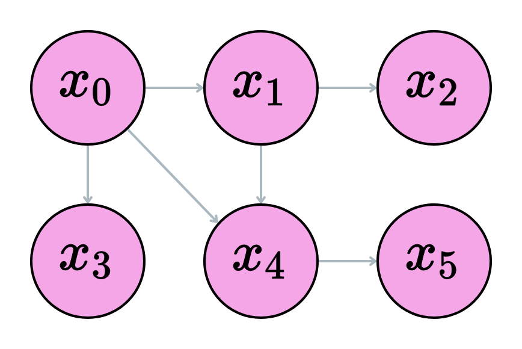
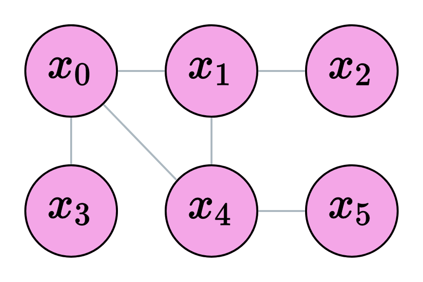
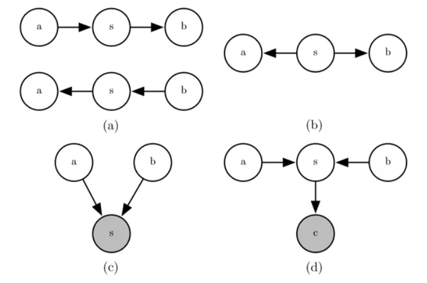
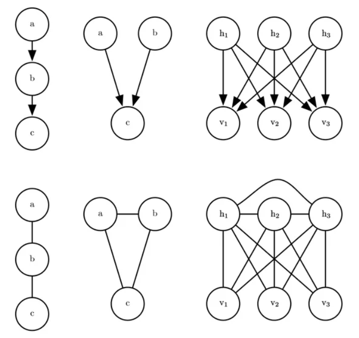
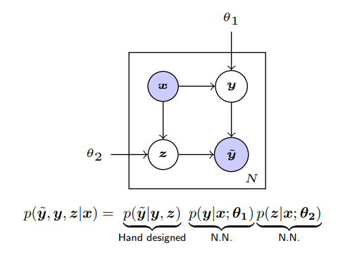

# Structured Learning

本周我們研究 Structured Learning 用來 modeling 資料的 probabilities

Note: 本篇筆記參考 NCTU/CS Spring 2018

## 圖的種類

圖的種類分為很多種，我們這裡主要講解有向圖以及無向圖，為了方便起見，我們只考慮沒有 cyclic 的圖

- Node: 隨機向量
- Edge: 隨機向量之間的影響方向
- Graph: 隨機場

### 有向圖

有向圖 Directed Acyclic Graph (DAG) 中，我們把 $x_i$ 作為 Node 的隨機向量，則 DAG 中點的聯合概率分配為

$$
p(x_1, \cdots, x_n) = \prod_i p(x_i|P_{a_\mathbb{g}(x_i)})
$$

其中 $P_{a_\mathbb{g}(x_i)}$ 表示圖 $\mathbb{g}$ 中點 $x_i$ 的所有父節點

#### Examples

假設我們知道機率模型可以用以下 DAG 表示

則點的聯合概率分配為 

$$
p(x) = p(x_0)p(x_1|x_0)p(x_2|x_1)p(x_3|x_0)p(x_4|x_1, x_0)p(x_5|x_4)
$$

- $x_0$ 沒有任何父節點，故概率為 $p(x_0)$
- $x_1$ 的父節點為 $x_0$，故概率為 $p(x_1|x_0)$
- $x_4$ 有兩條進入邊，故概率為 $p(x_4|x_1, x_0)$

注意在圖中，我們並沒有描述 $x_2$ 與 $x_0$ 之間的關係，故 $x_2$ 與 $x_0$ 條件獨立，即 

$$
p(x_2|x_1,x_0)=p(x_2|x_1)
$$

#### Time Complexity

假設我們的概率圖共有 $n$ 個點，每一個點可以取值 $\{1,\cdots, k\}$，則我們需要一個表去紀錄 $k^n$ 種可能性

例如在影像分割 (Image Segmentation) 任務中，假設我們的 pixels 服從隨機場 $\{x_1,\cdots, x_n\}$ 且共有 $k$ 個類別，我們就必須計算每個 $\arg\max_j p(j|x_i)$ 以找到該 pixels 屬於哪個類別

因此，我們最好是能夠結構化圖的信息，這樣會幫助我們簡化計算

### 無向圖

有向圖 UnDirected Acyclic Graph (UAG) 中，我們把 $x_i$ 作為 Node 的隨機向量，則 DAG 中點的聯合概率分配為

$$
p(x_1, \cdots, x_n) = \frac{1}{Z}\prod_{C\in \mathbb{g}} \phi(C)
$$

其中 

- $C$: maximum clique，我們在下一章節中會介紹
- $Z$: 被稱作標準化因子 (normalized factor)，其作用保證機率值介於  [0,1]  區間
- $\phi(C)$: 被稱為 clique potential 函數

#### Clique

- Clique: 一張圖中的子圖，且滿足子圖中任意兩點有邊相連 (就是子圖中的完全圖)
- Maximum clique: 在一個 clique 中，如果再加入任何一個點會無法保證 clique 結構，則稱為 maximum clique

#### Examples

假設我們知道機率模型可以用以下 DAG 表示

則點的聯合概率分配為 

$$
p(x) = \frac{1}{Z}\phi_a(x_0,x_3)\phi_b(x_0,x_1,x_4)\phi_c(x_1,x_2)\phi_d(x_4,x_5)
$$

- $\phi$: clique potential，用來衡量 clique 內點的相似程度
- $Z$: 被稱作標準化因子 (normalized factor)，其作用保證機率值介於  [0,1]  區間

注意在圖中，$x_0$ 與 $x_1$ 之間雖然可以形成一個 clique，但是卻不是 maximum clique，因為 $x_0, x_1$ 和 $x_4$ 可以形成一個 clique

#### Choice of $\phi$

$\phi$ 函數的選擇通常可以是 energy-based 模型

$$
\phi(C) = e^{-E(x_C)}
$$

其中 $x_C$ 表示所有在 $C$ 中的點

#### UAG in Segmentation

我們來講講在電腦視覺領域上的 CRFs 如何建模，回憶我們前文所提，我們意旨於找到一個隱藏序列可以最大化給定觀測值的機率，即

$$
\arg\max_y p(y|x)
$$

在影像分割領域中

- Consider an image $I$ with $n$ pixels segmentate to $k$ classes
- Model the segmentation to a random field $X=\{X_1,\cdots, X_n\}$ where $X_i$ takes value in $1,\cdots,k$
- $y:$ 影像分割的 Output
- $x:$ 原影像
- Let $C$ be a clique, $X_C$ be the observation data in $C$
- $p(X)=\frac{1}{Z}\prod_C\psi_C(X_C)$ where potential function is defined as $\psi_C(X_C)=e^{-E(X_C)}$ and $E(X_C)=\sum_i\psi_u(x_i)+\sum_{i\textless j}\psi_p(x_i, x_j)$

##### Energy function

- $E(X_C)=\sum_i\psi_u(x_i)+\sum_{i\textless j}\psi_p(x_i, x_j)$
- The value of energy function indicates that the degree of stationary of the state (lower value indicate stationary)
- $\sum_i\psi_u(x_i):$ the pixels assign the wrong labels $(|X_C|=1)$
- $\sum_{i\textless j}\psi_p(x_i, x_j):$ all the pair of points assign different labels $(|X_C|=2)$

注意到在能量函數中，unary potential 通常為 CNN 模型的輸出，pairwise potential 則是需要去決定的函數

##### Intuitive

看了這麼多數學，都快吐了，我們來看看直覺上 CRFs 代給我們什麼?

- (a) 原影像
- (b) 將影像的 pixel 點建模成隨機場的形式
- (c) 通過 CNN 得到 unary output (這時有些點被分錯) (unary potential)

\textless details>
\textless summary>為什麼會分錯呢? 點擊查看解答\textless /summary>
CNN 只關注 local 範圍的物件
\textless /details>

- (d) 這時候我們可以根據影像的一些特徵，如 pixels 之間的亮度，位置等等去懲罰那些分錯的點 (pairwise potential)

### D-Separation

為了簡化訊息，我們希望能夠結構化較為複雜的 DAG，D-Separation (Dependence-Separation) 可以用來快速判斷節點之間是否是條件獨立。或者 D-Separation 可以幫助判斷點之間的間接關係

假設在上圖中，我們想知道點集合 a 與 b 之間是否在給定 s 下條件獨立，即 

$$
p(a, b|s) \overset{?}{=} p(a|s)p(b|s)
$$

為了解決這個問題，我們可以進一步拆解所有情況

- (a) 給定中介因子 $s$，$a$ 和 $b$ 是獨立的
   - (a, s, b) = (吃地瓜, 放屁, 房間臭)
   - **吃地瓜**導致容易放屁，**放屁**太多房間會臭，但是**吃地瓜**和**房間臭**並沒有直接關係
   - 在給定**放屁**的情況下，**吃地瓜**與**房間臭**是條件獨立的
- (b) 給定中介因子 $s$，$a$ 和 $b$ 是獨立的
   - (a, s, b) = (邏輯能力, 年齡, 鞋子尺碼)
   - **年齡**越大，通常**邏輯能力**越好，穿的鞋子也越來越大，但是**邏輯能力**好和**鞋子尺碼**大沒有關係
   - 在給定**年齡**的情況下，**邏輯能力**與**鞋子尺碼**是條件獨立的
- (c) 給定中介因子 $s$，$a$ 和 $b$ 是相依的
   - (a, s, b) = (包包, 總消費金額, 高跟鞋)
   - 給定**總消費金額**為 10000，**包包**花了 7000，那麼**高跟鞋**只會花 3000
   - 在給定**總消費金額**的情況下，**包包**與**高跟鞋**是條件相依的
- (d) 給定中介因子 $s$ 以及任何她的子代 $c$，$a$ 和 $b$ 是相依的
   - 對於任意中介效應的子代，根據 Explaining Away Effects a, b 之間為條件相依

#### Explaining Away Effects

類似條件限制式的概念 (a+b=s)，在給定 s 之下，當我們觀察到 a 之後，b 也就固定了

### Separation

不同於 D-Separation，Separation 通常用來表示 UAG 中點集合的條件獨立與否

假設在上圖中，我們想知道點集合 a 與 b 之間是否在給定 s 下條件獨立，即 

$$
p(a, b|s) \overset{?}{=} p(a|s)p(b|s)
$$

我們只需檢查 s 是不是圖的一個 cut，簡單來說，能不能找到一條路徑從 a 走到 b，但是不能通過 s

- a, b 中存在一條路徑不通過 s: a, b 在給定 s 之下是條件相異的
- a, b 中不存在一條路徑通過 s: a, b 在給定 s 之下是條件獨立的

#### 有向圖到無向圖

有時候有向圖和無向圖的點和邊長的一樣，但是他們可能並不代表同一張圖

如果我們要把一張有向圖轉成無向圖，必須滿足

1. 如果 DAG 中 a 和 b 連邊，則 UAG 兩點也要連邊
2. 如果 DAG 中 a 和 b 有共同子代，則 UAG 中 a, b 也要連邊

上述例子中第二行

- DAG: $p(a)p(b)p(c|a,b)=\phi(a,b,c)$
- UAG: $\phi(a,b,c)=p(a)p(b)p(c|a,b)$

## Application

本章節將會較紹 graphic model 在不同假設下於深度學習中的應用

### Label Noise Model

其中一個 graphic model 的例子是 Label Noise Model

假設我們蒐集到的資料多數是噪聲標籤的

- Observations
   - $x$: 影像
   - $\tilde y$: 噪聲標籤
- Latent variables
   - $y$: 真實標籤
   - $z$: 噪聲標籤型態
     - $z=1:$ Noise free
     - $z=2:$ Random noise
     - $z=3:$ Confusing noise

我們的 graphic model 如下

由上述 DAG 的公式，我們可以得知聯合概率分配為

$$
p(\tilde y, y, z|x) = p(\tilde|y,z)p(y|x,\theta_1)p(z|x, \theta_2)
$$

- $p(\tilde y|y,z)$: 噪聲的條件分配
   - Noise free ($\tilde y=y$): $p(\tilde y|y,z)=\tilde y^\top Iy$
   - Random noise ($\tilde y\neq y$): $p(\tilde y|y,z)=\frac{1}{L-1}\tilde y^\top (U-I)y$
     - $U$: 全 1 矩陣
     - $L$: 正標籤個數
   - Confusion noise ($\tilde y\approx y$): $p(\tilde y|y,z)=\tilde y^\top Cy$

#### Optimization

由於我們有隱變量，我們使用 EM 算法來最佳模型參數

- E step: 計算概似估計的期望值 

$$
\begin{align*}
    J(\theta)&=E_p(y,z|\tilde y,x,\theta)\log p(\tilde y,y,z,|x, \theta)\\
    &=\sum_{y,z}p(y,z|\tilde y,x)[\log p(\tilde y|y, z, C)+\log p(y|x, \theta_1)+\log p(z|x,\theta_2)]
\end{align*}
$$

- M step: 最大化概似估計

$$
\begin{align*}
    \nabla_{\theta_1}J(\theta)=\sum_y p(y|\tilde y, x)\nabla_{\theta_1}\log p(y|x,\theta_1) \\
    \nabla_{\theta_2}J(\theta)=\sum_y p(y|\tilde y, x)\nabla_{\theta_2}\log p(z|x,\theta_2) \\
\end{align*}
$$

- Inference: 測試階段，我們只需要計算 $p(y|x,\theta_1)$

### Conditional Random Fields

條件隨機場是一個統計應用於神經網路的方法，他可以用於影像分割、自然語言處理等等，通常會接在網路後端對影像或者文字做進一步的優化，這裡我們著重介紹 CRFs 在影像分割上的用途

#### From Log Linear Model to CRFs

我們回憶我們學到的 log linear model 定義為 

$$p(y|x)=\frac{1}{Z(x)}\exp\sum_{k=1}^Kw_kF_k(x,y)$$

- $Z(x)=\sum_y\exp\sum_{k=1}^Kw_kF_k(x,y)$ 被稱作標準化因子 (normalized factor)，其作用保證機率值介於 $[0,1]$ 區間，且在同一個 $x$ 下有 $\sum_xp(y|x)=1$ 

- $F(x, y)$ 稱作特徵函數 (feature function)，用以衡量 $x$ 和 $y$ 共同出現的適配程度

CRFs 可以看做是 Log Linear Model 的一種，他把特徵函數定義為 $F(x,y)=\sum_{i=2}^nf_k(y_{i-1}, y_i,x,i)$

#### From HMM to CRFs

另一種代入 CRFs 的看法可以從 HMM (Hiden Markov Model) 講起，HMM 是個生成模型且定義如下

$$p(x,y)=p(y)p(x|y)=\prod_{t=1}^Tp(y_t|y_{t-1})p(x_t|y_t)$$

- $x_t$ 為觀測值，$y_t$ 為隱藏態 (hidden state)
- 馬可夫假設當前狀態 (current state) $y_t$ 只被前狀態 (previous state) 影響 $y_{t-1}$
- $p(y_t|y_{t-1})$ 被稱作轉移機率 (transition probability)，表示狀態之間轉移的可能性
- $p(x_t|y_t)$ 被稱作排放機率 (emission probability)，表因當前狀態而產生 (排出) 觀測值 $x_t$ 的可能性

不難看出，上式第一個等號為條件機率，其中 $y=\{y_1,\cdots, y_t\}$ 為狀態序列，第二個等號表示從第一個狀態轉移到最後一個狀態的機率，乘上狀態產生觀測值的機率

#### CRFs

我們回頭看看 CRFs 的特徵函數

- $p(y|x)=\frac{1}{Z(x)}\exp\sum_k w_k\sum_i f_k(y_{i-1}, y_i,x,i)$
- $\sum_i f_k(y_{i-1}, y_i,x,i)$ 代表在馬可夫假設下的任意子結構, 更精確的說, 給定一個觀測值 $x$, 他可以與任意隱狀態 $y_i$ 相關, 且馬可夫自然條件假設 $y_i$ 與 $y_{i-1}$ 相關
- Linear-chain CRFs 允許觀測值之間的任意連接
- $i$ 是一個強力參數，可用來考慮狀態的時間位置
- $w_k$ 用以衡量特徵函數的重要性，可以透過梯度下降學習

#### CRFs In CV

我們來講講在電腦視覺領域上的 CRFs 如何建模，回憶我們前文所提，我們意旨於找到一個隱藏序列可以最大化給定觀測值的機率，即

$$
\arg\max_y p(y|x)
$$

在影像分割領域中

- Consider an image $I$ with $n$ pixels segmentate to $k$ classes
- Model the segmentation to a random field $X=\{X_1,\cdots, X_n\}$ where $X_i$ takes value in $1,\cdots,k$
- $y:$ 影像分割的 Output
- $x:$ 原影像
- Let $C$ be a clique, $X_C$ be the observation data in $C$
- $p(X)=\frac{1}{Z}\prod_C\psi_C(X_C)$ where potential function is defined as $\psi_C(X_C)=e^{-E(X_C)}$ and $E(X_C)=\sum_i\psi_u(x_i)+\sum_{i\textless j}\psi_p(x_i, x_j)$

#### Energy function

- $E(X_C)=\sum_i\psi_u(x_i)+\sum_{i\textless j}\psi_p(x_i, x_j)$
- The value of energy function indicates that the degree of stationary of the state (lower value indicate stationary)
- $\sum_i\psi_u(x_i):$ the pixels assign the wrong labels $(|X_C|=1)$
- $\sum_{i\textless j}\psi_p(x_i, x_j):$ all the pair of points assign different labels $(|X_C|=2)$

注意到在能量函數中，unary potential 通常為 CNN 模型的輸出，pairwise potential 則是需要去決定的函數

#### MF Inference

#### FullCRFs

- $\psi_p(x_i,x_j|I)=\mu(x_i,x_j)\sum_{m=1}^Mw^{(m)}k^{(w)}_G(f_i^I,f_j^I)$
- $w^{(m)}$ are the learnable parameters of model
- $k(f_i^I,f_j^I)=\\w^{(1)}\exp(-\frac{|p_i-p_j|^2}{2\theta_\alpha^2}-\frac{|I_i-I_j|^2}{2\theta_\beta^2})+w^{(2)}\exp(-\frac{|p_i-p_j|^2}{2\theta_\gamma^2})$
- $w^{(1)}, w^{(2)},\theta_\alpha, \theta_\beta, \theta_\gamma$ are learnable parameters
- ConvCRFs complains that the message passing is the bottleneck of CRF with $O(\text{number of pixels}^2)$ time complexity

#### ConvCRFs

- Consider an image $I$ with $n$ pixels segmentate to $k$ classes
- Model the segmentation to a random field $X=\{X_1,\cdots, X_n\}$ where $X_i$ takes value in $1,\cdots,k$
- Goal: solve $\arg\max_XP(X|I)$
- $P(X|I)$ is modeled as $P(X=\hat x|I=\tilde I)=\frac{1}{Z(I)}\exp(-E(\hat x|I))$ where $E(\hat x|I)=\sum_{}\psi_u(\hat x_i|I)+\sum_{i\neq j\leq N}\psi_p(\hat x_i,\hat x_j|I)$

#### What's New?

- ConvCRFs assume that pair of pixels $i,j$ are joint independent if Manhattan distance $d(i,j)>k$ (You may regard $k$ as the filter size)
- Others word, $\sum_{i\neq j\leq N}\psi_p(x_i,x_j)=0$ if $d(i,j)>k$
- reformulate message passing function to truncated Gaussian kernel

#### Kernel function

- consider input $P$ with shape $[bs,c,h,w]$, the Gaussian kernel $g$ defined by feature vectors $f_1,\cdots,f_d$ each with shape $[bs,h,w]$
- $k_g[bs,dx,dy,x,y]=\\ \exp(-\sum_{i=1}^d\frac{|f_i^{(d)}[bs,x,y]-f^{(d)}_i[bs,x-dx,y-dy]|^2}{2\theta_i^2})$
- where $\theta_i$ are learnable parameters
- Merge gaussian kernel $K=\sum_{i=1}^sw_ig_i$
- In practice, $f_i$ is choose to be the RGB intensity and spatial location $x,y$ ($s=2$)
